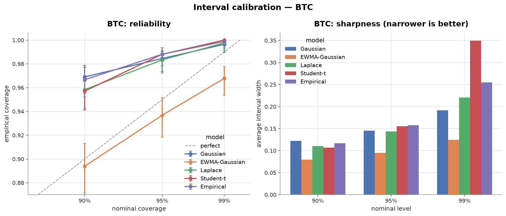
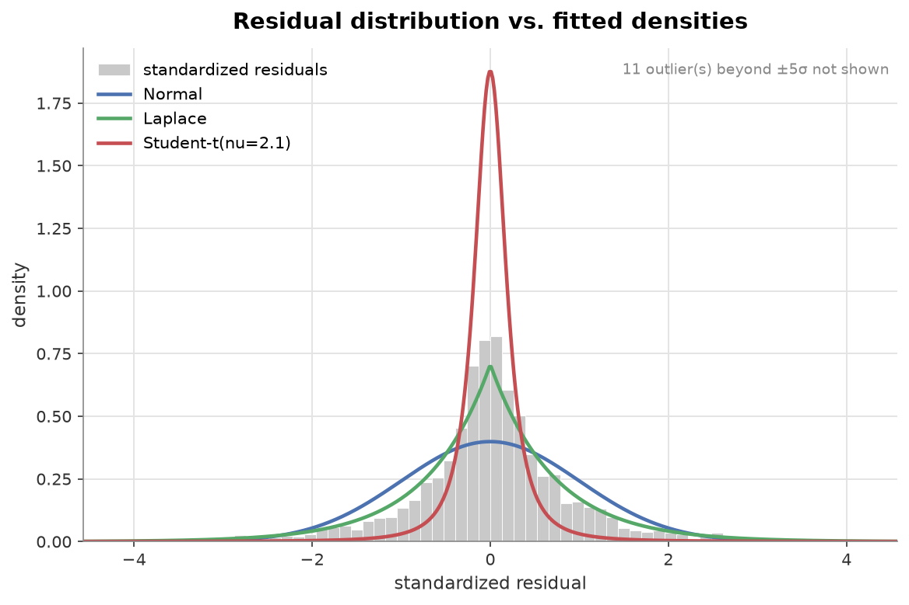
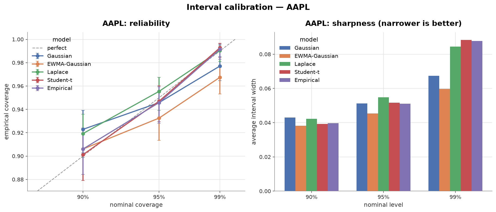
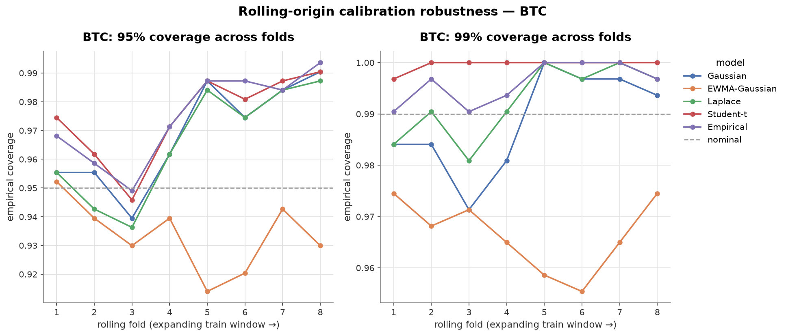
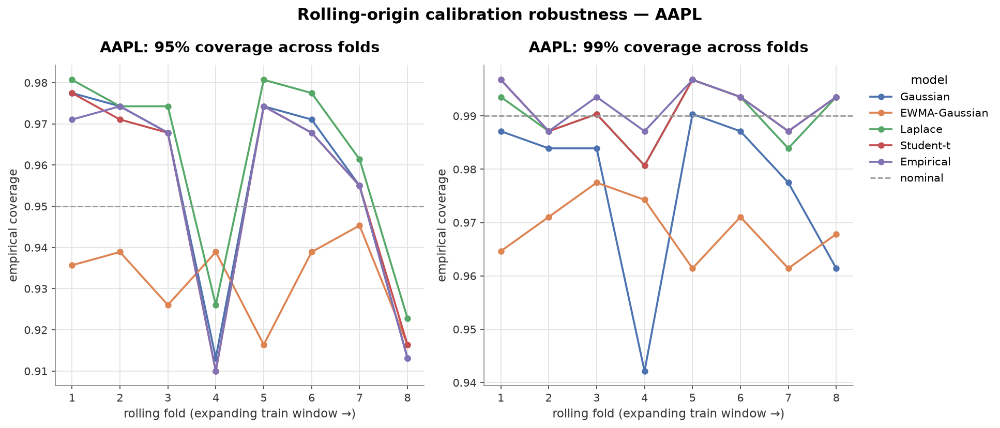
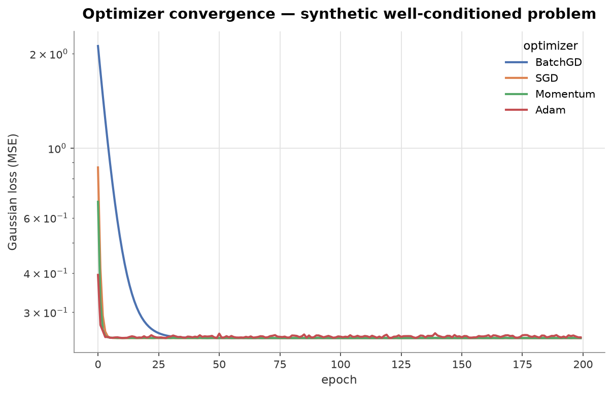

# From Likelihood to Loss

**Do competing error-distribution assumptions change the calibration of
prediction intervals on financial returns - and does a heavy-tailed model earn
its keep once volatility clustering is accounted for?**

---

## 1. Derivation: likelihood → loss

For a linear predictor $\hat{y} = Xw$ with i.i.d. errors $\varepsilon = y - \hat{y}$,
maximum likelihood minimizes the negative log-likelihood, which *is* the loss.

**Gaussian.** $p(\varepsilon) \propto \exp(-\varepsilon^2/2\sigma^2)$ gives
$-\log p = \tfrac{1}{2\sigma^2}\varepsilon^2 + \text{const}$. Summed over the
sample this is **MSE**, with gradient $\frac{2}{n}X^\top(Xw-y)$ - linear in the
residual, so large errors dominate quadratically.

**Laplace.** $p(\varepsilon) \propto \exp(-|\varepsilon|/b)$ gives
$-\log p = \tfrac{1}{b}|\varepsilon| + \text{const}$ - **MAE**. The gradient is
$\frac{1}{n}X^\top \operatorname{sign}(Xw-y)$; non-differentiable at zero, where
we take the subgradient $\operatorname{sign}(0)=0$. Linear penalty ⇒ median-like
robustness.

**Student-*t*.** $p(\varepsilon) \propto \left(1+\frac{\varepsilon^2}{\nu\sigma^2}\right)^{-(\nu+1)/2}$
gives a heavy-tailed NLL whose gradient carries the per-residual weight
$\frac{(\nu+1)\varepsilon}{\nu\sigma^2+\varepsilon^2}$. This weight *redescends* -
it rises then falls toward zero as $|\varepsilon|\to\infty$ - so extreme residuals
are actively discounted. That robustness is also why the Student-*t* NLL is
**non-convex in the weights**. As $\nu\to\infty$ the *t* converges to the
Gaussian and the loss back to MSE.

Each distribution also defines its **interval**: the same likelihood that yields
MSE yields $\hat{y}\pm z_{1-\alpha/2}\,\sigma$. Getting the distribution wrong
therefore mis-sizes the interval - which is what we measure.

---

## 2. Synthetic validation

Before touching real data, we generated data from each distribution with known
coefficients $w^\star=[0.5,-1.2,2.0,0.7]$ and confirmed recovery
(`experiments/01`):

| Error law | Optimizer(s) | max │ŵ − w★│ | ν recovery |
|---|---|---|---|
| Gaussian | BatchGD / SGD / Momentum / Adam | ≤ 0.048 | - |
| Laplace | Adam | 0.006 | - |
| Student-*t* | Adam (ν fixed) | 0.013 | ν̂ = 4.52 vs ν = 4.0 |

All optimizers recover the Gaussian coefficients; the separately-estimated ν
matches truth. The math and the machinery are sound. A committed test suite
(`tests/`, 32 tests) additionally gradient-checks every loss, verifies the
optimizers against the closed-form and scikit-learn solutions, and checks the
Wilson CI, Kupiec test, and the EWMA no-lookahead property.

*Data windows below are pinned for reproducibility (`--refresh` re-pulls the
latest); results are as of the 2026-07 snapshot.*

---

## 3. Primary result: BTC-USD daily log returns

Data: BTC-USD 2015-2026, daily log returns, AR(3)+|r| features, chronological
80/20 split (train 3356, test 839). Estimated **ν = 2.07**, residual **excess
kurtosis = 11.7** - the documented heavy tail is present.

**Coverage (nominal) / average width, held-out test set:**

| Model | 90% cov | 95% cov | 99% cov | width @95% | Kupiec 90% / 95% |
|---|---|---|---|---|---|
| Gaussian (fixed σ) | 0.969 | 0.985 | 0.996 | 0.145 | reject / reject |
| **EWMA-Gaussian** | **0.894** | **0.937** | 0.968 | **0.095** | **0.56 / 0.09 (ok)** |
| Laplace | 0.958 | 0.983 | 0.998 | 0.143 | reject / reject |
| Student-*t* | 0.957 | 0.988 | 1.000 | 0.156 | reject / reject |
| Empirical | 0.967 | 0.988 | 0.999 | 0.158 | reject / reject |

Two findings stand out:

1. **The fixed-variance models over-cover and are wide.** The chronological test
   window is calmer than the training era, so a single fixed σ estimated on the
   training period produces intervals too fat for the test period - the opposite
   of the naive "heavy tails ⇒ under-coverage" intuition, and a direct
   consequence of holding the variance model fixed across a volatility regime
   shift. The Student-*t* at ν ≈ 2 is the most extreme: its 99% interval is 0.35
   wide (vs 0.19 for the fixed Gaussian) and covers 100% of points.

2. **The volatility-scaled Gaussian dominates.** EWMA-Gaussian is the only model
   not rejected by the Kupiec test at 90% *and* 95%, and its intervals are ~35%
   narrower than every fixed-variance competitor. On BTC, adapting the *scale* to
   local volatility matters far more than adapting the *shape* of the error law.

*Reliability (left): EWMA-Gaussian tracks the perfect-calibration diagonal while
every fixed-variance model sits above it (over-covers). Sharpness (right):
EWMA-Gaussian is the narrowest at every level, while the Student-t interval
balloons at 99%.*

**Tail diagnostics** confirm the mechanism. Standardized-residual tail masses:

| | empirical | Normal | Laplace | *t*(ν=2.1) |
|---|---|---|---|---|
| P(│z│>2) | 0.058 | 0.046 | 0.059 | 0.008 |
| P(│z│>3) | 0.016 | 0.003 | 0.014 | 0.003 |
| P(│z│>4) | 0.006 | 0.000 | 0.004 | 0.002 |

The *unconditional* residual distribution looks like a *t* with ν ≈ 2 (variance
barely finite) - exactly what a **Gaussian scale mixture** (a Gaussian whose
variance changes over time) produces. That a single EWMA volatility step recovers
both calibration and sharpness is strong evidence that BTC's fat marginal tail is
**substantially volatility clustering, not a genuine per-observation heavy tail**.

---

## 4. Robustness

### 4.1 Cross-asset: AAPL-on-SPY

Market-model regression of AAPL returns on SPY, 2010-2026 (train 3316, test 830).
Estimated **ν = 3.62**, excess kurtosis **7.64**.

| Model | 90% cov (Kupiec) | 95% cov (Kupiec) | 99% cov (Kupiec) | width @95% |
|---|---|---|---|---|
| Gaussian (fixed σ) | 0.923 (reject) | 0.946 (0.58 ok) | 0.977 (reject) | 0.051 |
| EWMA-Gaussian | 0.906 (0.56 ok) | 0.933 (reject) | 0.967 (reject) | **0.045** |
| Laplace | 0.919 (0.06) | 0.955 (0.47 ok) | 0.990 (0.92 ok) | 0.055 |
| **Student-*t*** | **0.901 (0.91 ok)** | **0.947 (0.69 ok)** | **0.993 (0.40 ok)** | 0.052 |
| **Empirical** | **0.906 (0.56 ok)** | **0.946 (0.58 ok)** | **0.992 (0.64 ok)** | 0.051 |

**Here the conclusion flips.** On AAPL, the **Student-*t*** and **empirical**
models are well-calibrated at *every* level (no Kupiec rejection), while the
EWMA-Gaussian - best on BTC - is well-calibrated only at 90% and **under-covers**
at 95% and 99% (its intervals are too sharp once volatility is scaled out). The
tail diagnostics explain why: with ν ≈ 3.6, the *t* marginal tail masses (0.046,
0.014, 0.005) match the empirical ones (0.046, 0.015, 0.006) almost exactly -
this is a genuine heavy tail, not one manufactured by extreme volatility
clustering, so getting the *shape* right is what pays off.

*The story flips relative to BTC: Student-t and Empirical stay on the diagonal
across all levels, while EWMA-Gaussian drops below it (under-covers) at 95% and
99%.*

### 4.2 Cross-split: rolling-origin

The §3 and §4.1 results each rest on a single chronological split. To test whether
they are robust to *where* we split, an expanding training window is walked forward
in 8 folds for **each** dataset (`experiments/05`), re-fitting all five models per
fold and evaluating coverage on the next block (~314 obs for BTC, ~311 for AAPL).

**BTC** (mean coverage ± std over folds; Kupiec rejections at the 5% level):

| Model | 90% mean cov (± std) | rejects @90% | 95% mean cov | rejects @95% | 99% rejects |
|---|---|---|---|---|---|
| Gaussian | 0.947 (±0.027) | 6/8 | 0.969 | 4/8 | 2/8 |
| **EWMA-Gaussian** | **0.897 (±0.010)** | **0/8** | **0.934** | **2/8** | 8/8 |
| Laplace | 0.929 (±0.035) | 5/8 | 0.966 | 4/8 | 2/8 |
| Student-*t* | 0.927 (±0.035) | 5/8 | 0.975 | 5/8 | 7/8 |
| Empirical | 0.940 (±0.030) | 5/8 | 0.975 | 4/8 | 3/8 |

**AAPL-on-SPY:**

| Model | 90% mean cov (± std) | rejects @90% | 95% mean cov | rejects @95% | 99% rejects |
|---|---|---|---|---|---|
| Gaussian | 0.928 (±0.029) | 5/8 | 0.956 | 5/8 | 2/8 |
| **EWMA-Gaussian** | **0.902 (±0.013)** | **0/8** | **0.932** | **2/8** | 7/8 |
| Laplace | 0.921 (±0.031) | 3/8 | 0.962 | 6/8 | **0/8** |
| Student-*t* | 0.906 (±0.033) | 5/8 | 0.955 | 4/8 | **0/8** |
| Empirical | 0.910 (±0.032) | 4/8 | 0.954 | 4/8 | **0/8** |

The cross-split view **confirms** the dataset-dependent story rather than softening
it:

- **At 90%, volatility scaling is the most reliable on both datasets.**
  EWMA-Gaussian is the only model with 0/8 rejections at 90% on *both* BTC and
  AAPL, with 2-3× smaller fold-to-fold variance than any competitor - the most
  accurate *and* the most stable, independent of the split point.
- **In the deep tail the two datasets diverge, and do so consistently across all
  folds.** On AAPL the genuine heavy tail means Laplace, Student-*t*, and Empirical
  calibrate the 99% interval in *every* fold (0/8 rejections); on BTC *no* model
  does - EWMA under-covers (8/8) and the heavy-tailed laws over-cover. The BTC 99%
  tail wants time-varying scale *and* a heavy conditional tail at once - i.e. GARCH
  with a conditional Student-*t* (§7).

---

## 5. Optimizer convergence (sanity check)

On the convex Gaussian loss, all four from-scratch optimizers reach **identical
loss** (spread ≈ 6 × 10⁻⁶). The coefficient *weights* differ more (spread ≈ 2 ×
10⁻²) - not a convergence failure but a property of the problem: daily returns
are near-unpredictable, so the coefficients are weakly identified and the loss
surface is flat in those directions. Loss agreement is the meaningful signal, and
the headline result is not an Adam artifact.

On the Student-*t* loss the weight spread is larger (≈ 0.23) even from a shared
OLS initialization: the redescending, **non-convex** objective is genuinely more
sensitive to the optimizer and step size. (An earlier run with the convex-loss
learning rates let Momentum walk out of the OLS basin entirely - reducing the
rate fixes it, and the residual spread then reflects curvature, not divergence.)

*Convergence is shown on a synthetic well-conditioned problem - daily returns are
too weakly predictable for the loss to descend visibly. Full-batch gradient
descent converges smoothly over ~30 epochs; the mini-batch methods reach the
optimum within a few.*

---

## 6. Conclusion

The decisive factor for interval calibration is **not universally shape or
scale - it depends on the asset's tail regime**, and the study's two-baseline
design is what makes the distinction visible:

- **BTC (ν ≈ 2, extreme volatility clustering).** A one-parameter EWMA
  volatility-scaled Gaussian beats every fixed-variance model - Gaussian,
  Laplace, Student-*t*, and empirical alike - on both calibration and sharpness.
  Most of the apparent heavy tail is volatility clustering in disguise, and a
  genuine heavy-tailed law (ν ≈ 2) over-covers wildly at high confidence.
- **AAPL (ν ≈ 3.6, moderate tails).** A genuine Student-*t* and the
  non-parametric empirical baseline are best-calibrated across all levels, while
  volatility scaling alone under-covers at 95%+. Here the per-observation tail is
  real, and getting the distributional *shape* right is what matters.

So the falsifiable hypothesis - Student-*t* over fixed Gaussian - holds cleanly on
AAPL but not on BTC, where volatility scaling is the better answer. The right
model is the one matched to *why* the tail is heavy: conditional-variance
dynamics (BTC) versus genuine per-observation tail weight (AAPL). Disentangling
those two was the whole point.

---

## 7. Limitations and extensions

- **Regime shift under the chronological split.** Holding σ fixed across a
  train→test volatility change is what makes the fixed-variance models over-cover
  on BTC. A faithful consequence of the fixed-variance scope, not an error, but
  worth stating plainly.
- **ν estimated on unconditional residuals.** For BTC this yields ν ≈ 2.1, where
  the variance is barely finite, precisely because the unconditional residuals
  conflate tail weight with volatility clustering. Estimating ν *conditionally*
  (after volatility scaling) would likely give a larger, better-identified ν.
- **Fixed variance for four of five models.** Only the EWMA-Gaussian adapts its
  scale. A full **GARCH** conditional-variance model - combined with a
  conditional Student-*t* - is the natural next step and would properly separate
  volatility dynamics from residual tail shape. The BTC-vs-AAPL contrast above is
  a strong motivation for it.
- **ν held fixed, estimated separately.** Joint estimation of ν and the weights
  is non-convex and poorly identified in finite samples; a deliberate scope
  choice, noted as an extension rather than a limitation of the finding.
- **Not a trading strategy.** This is a calibration study; nothing here claims
  predictive edge on the *direction* of returns.
